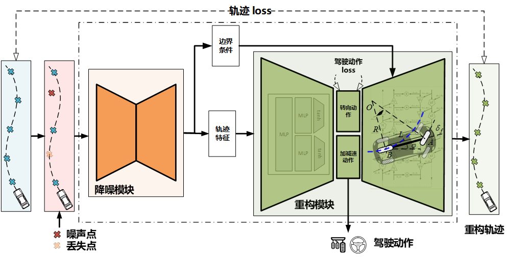

# 🚗 Data-Model Integrated Trajectory Reconstruction & Action Extraction  
> *"Make noisy trajectories physically-plausible again, and extract driver actions for free."*

  
  
  

---

## 🔍 Overview
TrajectoryNet is a **self-supervised** deep-learning framework that  
1. **denoises & reconstructs** vehicle trajectories while **strictly obeying kinematic constraints**,  
2. **extracts continuous driver actions** (acceleration & steering) **without labels**,  
3. **boosts downstream tasks** (prediction, planning) by **≈ 15 %** in full-precision and **≈ 5 %** in quantized models.

---

## 🚀 Key Features
| Feature                          | Description                                                                                      |
| -------------------------------- | ------------------------------------------------------------------------------------------------ |
| **Physics-in-the-loop**          | Vehicle kinematic model is **embedded as a differentiable decoder** – zero violation guaranteed. |
| **Label-free training**          | Only raw trajectories needed; no action labels required.                                         |
| **Bidirectional recursion**      | Mitigates error accumulation v.s. vanilla unidirectional methods.                                |
| **Cross-dataset generalization** | Trained on Argoverse 2, validated on nuScenes & real vehicle logs.                               |
| **Downstream friendly**          | Plug-and-play before any prediction/planning module.                                             |

---

## 📊 Performance Snapshot
| Metric                 | Direct calc.   | TrajectoryNet (ours) | Δ         |
| ---------------------- | -------------- | -------------------- | --------- |
| Acceleration error     | 1.69 m/s²      | **0.26 m/s²**        | **-84 %** |
| Steering error         | 9.5 × 10⁻³ m⁻¹ | **5.4 × 10⁻³ m⁻¹**   | **-43 %** |

---

## 📬 Contact
- Zhoudong Yan: <yanzd@tongji.edu.cn>  
- Peng Hang: <hangpeng@tongji.edu.cn>  

---

**⭐ Star us if you like the repo – it helps!**